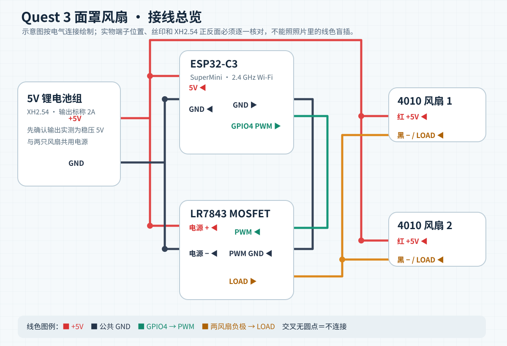
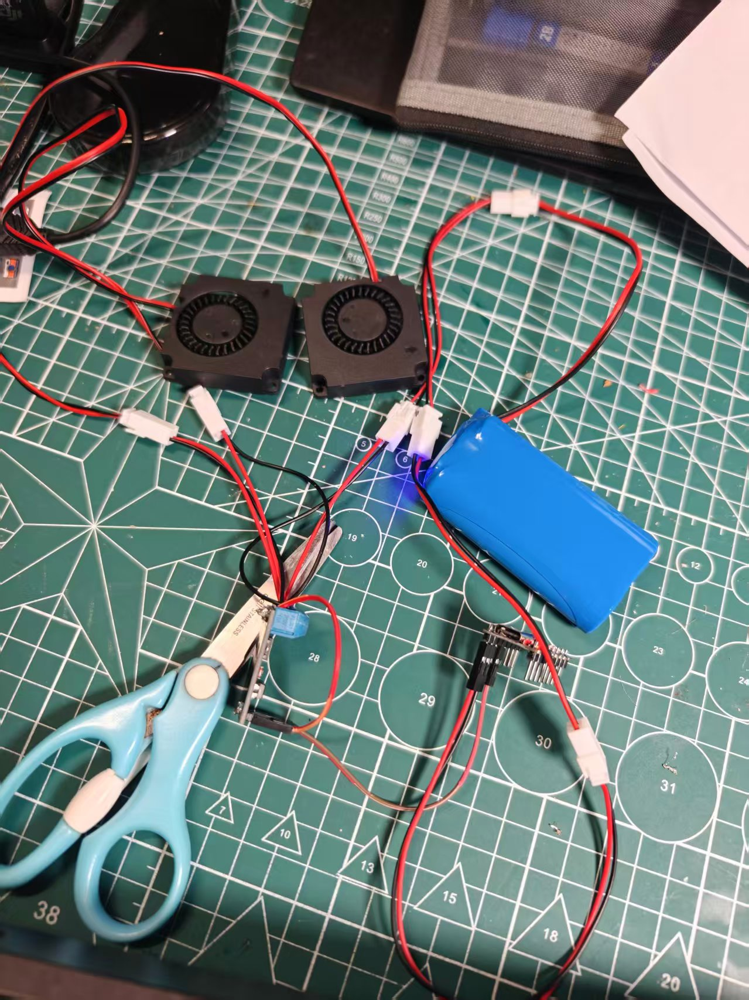
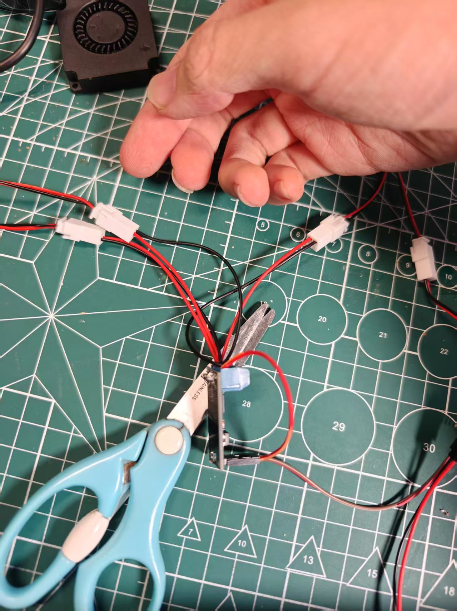
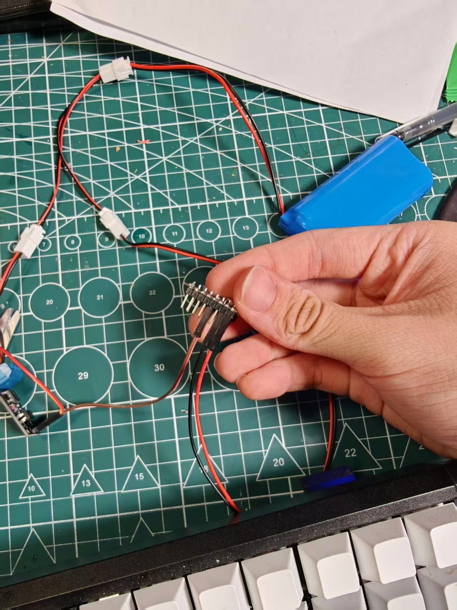
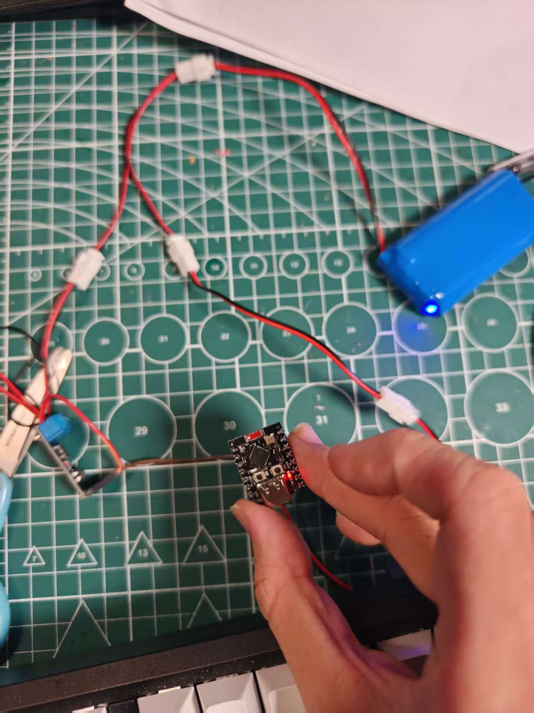

# Quest 3 面罩风扇 / Quest Fan

用 ESP32-C3 控制两只 5V 离心风扇。手机或电脑可以打开板子自带的控制网页；Quest 3 也能安装 APK，在头显里切换 80%、90%、100% 三挡或关闭风扇。板子和头显通过局域网通信，不需要电脑一直连着。

目前需要手动打开应用操作。戴上头显自动启动还没有实现。

## 准备材料

- ESP32-C3 SuperMini ×1
- 5V 4010 两线离心风扇 ×2
- LR7843 MOSFET 开关模块 ×1
- 稳定输出 5V 的电池组 ×1；图中使用 XH2.54 插头、标称最大输出 2A 的电池组
- XH2.54 分线器、转接线、杜邦线，以及固定和绝缘用的材料

两只风扇一起调速，不能分别控制。电池组必须输出 5V，不能把裸锂电芯直接接到 ESP32 的 5V 脚。

## 接线

先看接线图，再对照下面的照片整理线束。接线或焊接前，先拔掉电池和 USB。接上电池前用万用表量一下实际输出和正负极，不要只凭插头形状或线色判断。

- 电池 **+5V** 分给 ESP32 的 `5V`、LR7843 的电源 `+`、两只风扇的红线。
- 电池 **GND** 分给 ESP32 的 `GND` 和 LR7843 的电源 `-`。
- 两只风扇的黑线并在一起，接 LR7843 的 `LOAD`。
- ESP32 的 `GPIO4` 接 LR7843 控制排针的 `PWM`；控制排针的 `GND` 接 ESP32 的 `GND`。ESP32 和驱动板要共地。

照片里的白色 XH2.54 插头和分线器用来分配电源，蓝色螺丝端子接驱动板的电源与风扇线，杜邦线连接 ESP32 和驱动板的控制排针。把线插入螺丝端子后拧紧，别让铜丝露在外面；通电前再检查一遍有无短路。

## 给 ESP32 烧录固件

1. 安装 Arduino IDE 和 Espressif 的 Arduino-ESP32 板包。项目用 3.3.12 编译过。
2. 把 [`firmware/quest-fan/secrets.example.h`](firmware/quest-fan/secrets.example.h) 复制成同目录的 `secrets.h`，填上你自己的 `WIFI_SSID` 和 `WIFI_PASS`。ESP32-C3 只能连 **2.4 GHz Wi-Fi**。`secrets.h` 不会提交到仓库。
3. 在 Arduino IDE 打开 [`firmware/quest-fan/quest-fan.ino`](firmware/quest-fan/quest-fan.ino)，板型选 **ESP32C3 Dev Module**，选好实际串口，先编译再上传。烧录时先断开电池，只用 USB 给板子供电。
4. 上传完成后接回 5V 电池。ESP32 上电后会自动连接刚才填写的 Wi-Fi。

固件会记住上次的开关状态和挡位：如果上次没关风扇，再次上电可能马上转起来。

## 找到板子的 IP，打开网页

1. 手机或电脑连上与板子互通的局域网。在路由器管理页面打开「已连接设备」「在线设备」或「DHCP 客户端列表」（不同路由器叫法不一样）。
2. 找到名为 `questfan` 的设备，记下它的 **IPv4 地址**。如果列表里不显示设备名称，可以先给板子断电、刷新设备列表，再重新通电，看新出现的是哪台；打开它的详情页还能看到 MAC 地址。
3. 在浏览器地址栏输入 `http://板子的IPv4地址/`，就能看到四个控制按钮。比如路由器显示 `192.168.1.42`，就输入 `http://192.168.1.42/`。这里的数字只是示范，请用你路由器实际分配的地址。

建议在路由器里把地址固定下来：在 `questfan` 的设备详情里找「IP 与 MAC 绑定」「DHCP 静态租约」或「地址保留」，用设备的 **MAC 地址**绑定你希望它使用的局域网 IP，保存后让板子重新连接 Wi-Fi，再回设备列表确认新地址。选同一网段、未被其他设备占用的地址；不要把上面的示范地址直接写进固件。这样以后打开网页、在头显应用里填写的地址都不会随 DHCP 租约变化。

网页由 ESP32 自己提供。仓库里的 [`web/index.html`](web/index.html) 是网页源码，修改网页后需要重新编译、烧录固件才会显示在板子上。控制接口只适合在自己的局域网内使用，不要将板子的 80 端口映射到互联网。

## 在 Quest 3 安装应用

1. 打开 Quest 开发者模式，用 USB 数据线把头显接到电脑，在头显里允许 USB 调试。运行 `adb devices`，确认状态显示为 `device`。
2. 在仓库根目录运行 `adb install -r android/dist/QuestFan-1.0.apk`。应用名称是「面罩风扇」，可到头显应用库的「未知来源」中打开。
3. 头显连接能访问 ESP32 的 Wi-Fi，在应用中填写刚才查到的板子 IPv4，点击「连接」，然后选择挡位或关闭。安装后可以拔掉 USB，电脑也不用保持开机。

[APK](android/dist/QuestFan-1.0.apk) 是供个人侧载的调试签名版本；[Android 源码和构建脚本](android/)也在仓库里。自行重新签名的 APK 可能无法直接覆盖安装现有版本。

## 源码和接口

固件在 [`firmware/quest-fan/`](firmware/quest-fan/)，接线图与照片在 [`hardware/`](hardware/)。开发时可以运行 `python scripts/check_release.py` 检查发布文件；Android 测试与构建用 `bash android/scripts/build.sh`，需要 Java 17、Android SDK Platform 34 和 Build-Tools 35.0.0。

ESP32 提供 `GET /state` 读取开关、挡位及 IP；`GET /gear?v=80`（也支持 90、100）开启并换挡；`GET /off` 关闭。PWM 引脚是 GPIO4。当前没有戴上头显自动启动功能。

项目使用 [MIT License](LICENSE)。
